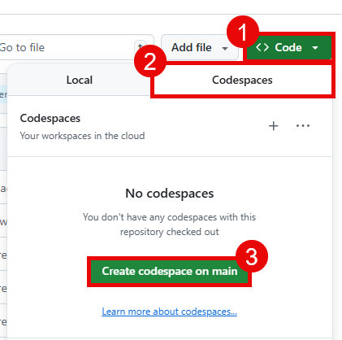

# Task 01 - Deploy a Bicep script

## Introduction

Before you can start building your AI shopping assistant, you need to deploy the necessary Azure resources. This includes setting up a resource group, deploying a Bicep script to create the required infrastructure, and configuring environment variables for your application.

## Description

In this task, you will deploy a Bicep script that sets up the necessary Azure resources for your AI shopping assistant. This includes creating a resource group and deploying the required infrastructure. In addition, you will install any software prerequisites needed for the application to run.

## Success Criteria

- You have installed software necessary for the application to run.
- You have created a resource group in Azure.
- You have deployed a Bicep script to create the necessary Azure resources.

## Learning Resources

- Cloning a repository via the [command line](https://docs.github.com/en/github/creating-cloning-and-archiving-repositories/cloning-a-repository) or [GitHub Desktop](https://docs.github.com/en/desktop/contributing-and-collaborating-using-github-desktop/cloning-a-repository-from-github-to-github-desktop)
- [az group (Azure Resource Group)](https://learn.microsoft.com/cli/azure/group?view=azure-cli-latest)
- [Create Bicep files by using Visual Studio Code](https://learn.microsoft.com/azure/azure-resource-manager/bicep/visual-studio-code?tabs=CLI)
- [Azure Developer CLI (azd)](https://learn.microsoft.com/azure/developer/azure-developer-cli/overview?tabs=linux)

## Key Tasks

### 01: Fork the repository

Fork [this GitHub repository](https://github.com/microsoft/TechWorkshop-L300-AI-Apps-and-Agents) to your account. You will need to fork the repo in order to modify and use GitHub Actions workflows in later tasks.

<details markdown="block">
<summary><strong>Expand this section to view the solution</strong></summary>

In order to fork this repository, make sure that you are signed in to GitHub with the account you would like to use. Then, select the **Fork** button.


On the next page, select your account as the Owner and leave the repository name alone. Then, select **Create fork** to complete the process.


</details>

### 02: Run Codespace or install necessary software

To work through this training, you can either use a GitHub Codespace or install the necessary software on your local machine.

To use a GitHub Codespace, navigate to your forked repository and select the **Code** button. Then, select the **Codespaces** tab and choose **Create codespace on main**.



This Codespace is pre-configured with all the necessary software to complete this training.

Alternatively, you can install the necessary software on your local machine. This includes:

- [Azure CLI](https://learn.microsoft.com/cli/azure/install-azure-cli)
- [Azure Developer CLI (azd)](https://learn.microsoft.com/azure/developer/azure-developer-cli/install-azd)
- [A Git client](https://git-scm.com/download/). An alternative option is to install [GitHub Desktop](https://desktop.github.com/).
- [Python 3.10 - 3.13](https://www.python.org/downloads/)
- [Visual Studio Code](https://code.visualstudio.com/download)
- [The Bicep tools Visual Studio Code extension](https://marketplace.visualstudio.com/items?itemName=ms-azuretools.vscode-bicep)
- [Docker Desktop](https://www.docker.com/products/docker-desktop/) (optional, but recommended)
- [uv](https://docs.astral.sh/uv/getting-started/installation/)
- [GitHub (gh) CLI](https://cli.github.com/)

{: .note }
> As of the latest update (April 2026), not all of the packages in this demo support Python 3.14. Python 3.12 and 3.13 are good choices for Python versions, as all of the packages you will use support these versions.

If you do not use a Codespace, you will also need to clone the repository to your local machine.

You can do this using the following command:

```bash
git clone https://github.com/<your-username>/TechWorkshop-L300-AI-Apps-and-Agents.git
```

Make sure to replace `<your-username>` with your actual GitHub username.

### 03: Deploy Azure resources using azd

After you have set up your development environment, the next step is to deploy the necessary Azure resources. You will use the [Azure Developer CLI (azd)](https://learn.microsoft.com/azure/developer/azure-developer-cli/overview) to provision infrastructure. The `azd` tool will create a resource group, deploy the Bicep template, and automatically filter available regions based on resource availability and OpenAI model quota.

<details markdown="block">
<summary><strong>Expand this section to view the solution</strong></summary>

First, ensure that you are logged into both the Azure CLI and the Azure Developer CLI. You can do so using the following commands on a local machine:

```bash
az login
azd auth login
```

Or in a Codespace VM:

```bash
az login --use-device-code
azd auth login --use-device-code
```

{: .note }
> If you receive an error message reading, "Your sign-in was successful but does not meet the criteria to access this resource," you are likely using a Microsoft EMU account or some other account that has stringent restrictions on machine access. You will need to use an external MCAPS subscription or some other paid subscription to continue. A Visual Studio subscription will **not** be sufficient, as these accounts will likely not have access to Microsoft Foundry and the language models we will use.

Before deploying, you can optionally run the pre-flight quota check script to verify that your subscription has the required resource providers registered and available in the candidate regions (Cosmos DB, Container Registry, AI Services, Container Apps):

```bash
# Check the default regions (eastus2, swedencentral, francecentral)
python src/infra/check_quota.py

# Or add additional regions to check
python src/infra/check_quota.py westus2 northeurope
```

Once you have confirmed a viable region, from the root directory of the repository, run:

```bash
azd up
```

The `azd up` command will prompt you for:

1. **Environment name** -- enter a name such as `techworkshop-l300-ai-agents`.
2. **Azure subscription** -- select the subscription you would like to use.
3. **Azure location** -- select a region. The location picker will only show regions where required resources are available and sufficient OpenAI model quota exists. Recommended regions include **East US 2**, **Sweden Central**, and **France Central**.

{: .note }
> If none of the recommended regions appear in the list, your account may not have sufficient quota. You can check your quota in the [Azure portal](https://portal.azure.com/) under **Subscriptions > Usage + quotas**. If you need to use a region outside the recommended list, be aware that you may not be able to run the Red Teaming agent in Exercise 06.

The `azd up` command will create a resource group named `rg-<environment-name>` and deploy all required infrastructure. You can monitor the progress of the deployment in the terminal output, which includes a link to the deployment in the Azure portal.


</details>

### 04: Enable Cosmos DB Vector Search

The final key task is to enable Vector Search for NoSQL API in your Cosmos DB account. This may take 15 or more minutes to become active, so enabling this now will ensure that the setting is enabled when you need it in Exercise 1 Task 3.

{: .note }
> The Bicep script you have run already includes a command to enable Vector Search for the Comsos DB NoSQL API, but this command does not always work as expected (or in a timely fashion). If you see that vector search is already enabled, you do not need to re-enable it--you are already good to continue.

<details markdown="block">
<summary><strong>Expand this section to view the solution</strong></summary>

Navigate to the [Azure portal](https://portal.azure.com/) and open the Cosmos DB account that you created.

Before you can create the container that you will use for this training, you will need to enable vector search for the Cosmos DB NoSQL API. To do so, navigate to the **Settings** section of your Cosmos DB account and select **Features**. Then, select the **Vector Search for NoSQL API** option.


Select the **Enable** button to enable vector search. This may take up to 15 minutes for the policy to become active.


</details>