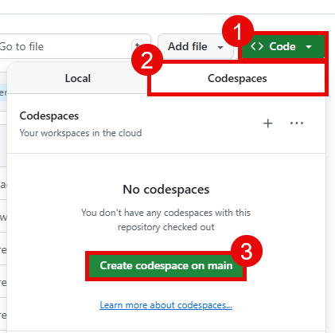

# Task 01 - Deploy a Bicep script

## Introduction

Before you can start building your AI shopping assistant, you need to deploy the necessary Azure resources. This includes setting up a resource group, deploying a Bicep script to create the required infrastructure, and configuring environment variables for your application.

## Description

In this task, you will deploy a Bicep script that sets up the necessary Azure resources for your AI shopping assistant. This includes creating a resource group and deploying the required infrastructure. In addition, you will install any software prerequisites needed for the application to run.

## Success Criteria

- You have installed software necessary for the application to run.
- You have created a resource group in Azure.
- You have deployed a Bicep script to create the necessary Azure resources.

## Learning Resources

- Cloning a repository via the [command line](https://docs.github.com/en/github/creating-cloning-and-archiving-repositories/cloning-a-repository) or [GitHub Desktop](https://docs.github.com/en/desktop/contributing-and-collaborating-using-github-desktop/cloning-a-repository-from-github-to-github-desktop)
- [az group (Azure Resource Group)](https://learn.microsoft.com/cli/azure/group?view=azure-cli-latest)
- [Create Bicep files by using Visual Studio Code](https://learn.microsoft.com/azure/azure-resource-manager/bicep/visual-studio-code?tabs=CLI)
- [Azure Developer CLI (azd)](https://learn.microsoft.com/azure/developer/azure-developer-cli/overview?tabs=linux)

## Key Tasks

### 01: Fork the repository

Fork [this GitHub repository](https://github.com/microsoft/TechWorkshop-L300-AI-Apps-and-Agents) to your account. You will need to fork the repo in order to modify and use GitHub Actions workflows in later tasks.

<details markdown="block">
<summary><strong>Expand this section to view the solution</strong></summary>

In order to fork this repository, make sure that you are signed in to GitHub with the account you would like to use. Then, select the **Fork** button.


On the next page, select your account as the Owner and leave the repository name alone. Then, select **Create fork** to complete the process.


</details>

### 02: Run Codespace or install necessary software

To work through this training, you can either use a GitHub Codespace or install the necessary software on your local machine.

To use a GitHub Codespace, navigate to your forked repository and select the **Code** button. Then, select the **Codespaces** tab and choose **Create codespace on main**.



This Codespace is pre-configured with all the necessary software to complete this training.

Alternatively, you can install the necessary software on your local machine. This includes:

- [Azure CLI](https://learn.microsoft.com/cli/azure/install-azure-cli)
- [Azure Developer CLI (azd)](https://learn.microsoft.com/azure/developer/azure-developer-cli/install-azd)
- [A Git client](https://git-scm.com/download/). An alternative option is to install [GitHub Desktop](https://desktop.github.com/).
- [Python 3.10 or later](https://www.python.org/downloads/)
- [Visual Studio Code](https://code.visualstudio.com/download)
- [The Bicep tools Visual Studio Code extension](https://marketplace.visualstudio.com/items?itemName=ms-azuretools.vscode-bicep)
- [Docker Desktop](https://www.docker.com/products/docker-desktop/) (optional, but recommended)

If you do not use a Codespace, you will also need to clone the repository to your local machine.

You can do this using the following command:

```bash
git clone https://github.com/<your-username>/TechWorkshop-L300-AI-Apps-and-Agents.git
```

Make sure to replace `<your-username>` with your actual GitHub username.

### 03: Create a resource group in Azure

After you have set up your development environment, the next step is to create a resource group in Azure.

<details markdown="block">
<summary><strong>Expand this section to view the solution</strong></summary>

You can do this using the following command in the Azure CLI, assuming you are logged in and have selected the correct subscription:

```bash
az group create --name techworkshop-l300-ai-agents --location eastus2
```

Alternatively, you may choose to do this from [the Azure portal](https://portal.azure.com/). In the search bar at the top, search for and select **Resource groups**. Then, select the **+ Create** button to create a new resource group. Choose your subscription and give the resource group a name such as `techworkshop-l300-ai-agents`.

Make sure to choose from one of the following regions for the resource group location:

- East US 2
- Sweden Central
- France Central
- Switzerland West

The reason for this is that certain Azure services used in this training are currently only available in these regions.

</details>

### 04: Deploy the Bicep script

You will use either the Azure CLI or the Bicep extension in Visual Studio Code to deploy the Bicep script that sets up the necessary Azure resources for this training.

<details markdown="block">
<summary><strong>Expand this section to view the solution</strong></summary>

When we deploy the Bicep stack we need to inject a parameter that contains your principal ID so that we can define a role assignment that gives you the Data Contributor role on your CosmosDB account.  In Visual Studio Code open a new Terminal and ensure that you are in the root of your workspace.

To generate the parameter file on Linux or macOS, issue the following command:

```bash
cat > parameters.json << EOF
{
  "\$schema": "https://schema.management.azure.com/schemas/2019-04-01/deploymentParameters.json#",
  "contentVersion": "1.0.0.0",
  "parameters": {
    "userPrincipalId": {
      "value": "$(az ad signed-in-user show --query id -o tsv)"
    }
  }
}
EOF
```

To generate the parameter file in PowerShell on Windows, issue the following command:

```powershell
@"
{
  "`$schema": "https://schema.management.azure.com/schemas/2019-04-01/deploymentParameters.json#",
  "contentVersion": "1.0.0.0",
  "parameters": {
    "userPrincipalId": {
      "value": "$(az ad signed-in-user show --query id -o tsv)"
    }
  }
}
"@ | Out-File -FilePath parameters.json -Encoding utf8
```

Next we will deploy the Bicep stack, passing in parameters.json.  This can be done either via CLI or the Visual Studio Code Bicep extension.

To deploy via CLI in Linux or macOS, issue the following command:

```bash
az deployment group create \
  --resource-group techworkshop-l300-ai-agents \
  --template-file src/infra/DeployAzureResources.bicep \
  --parameters parameters.json
```

To deploy via CLI in PowerShell on Windows, issue the following command:

```powershell
az deployment group create `
  --resource-group techworkshop-l300-ai-agents `
  --template-file src/infra/DeployAzureResources.bicep `
  --parameters parameters.json
```

To deploy the Bicep stack using the Visual Studio Code Bicep extension, open Visual Studio Code and select **File > Open Folder**. Then, navigate to the location where you cloned the repository and open that folder. Then, strike `Ctrl+Shift+P` (or `Cmd+Shift+P` on macOS) to open the command palette. In the command palette, type `Bicep: Deploy Bicep File` and select that option.


Choose the file `src/infra/DeployAzureResources.bicep` from the file dialog.


You may be prompted to sign into your Azure account. If so, follow the prompts to complete the sign-in process. Then, strike `Enter` to accept the default deployment name.


After that, you will need to select the subscription and resource group where you would like to deploy the resources. Choose the same resource group that you created in the previous step.


Finally, you will be prompted for a parameter file. Select **Browse**.


Then enter the path to the root of your workspace and click or select `parameters.json`.


In the console window, you will find a link to the deployment in the Azure portal. You can select this link to monitor the progress of the deployment.


</details>

### 05: Set additional permissions

After running the Bicep script, you have created several Azure resources. However, to ensure that your application can access Cosmos DB, you need to set additional permissions for the signed-in user.

<details markdown="block">
<summary><strong>Expand this section to view the solution</strong></summary>

In Visual Studio Code, open a new terminal window by selecting **Terminal > New Terminal** from the menu.

Then, ensure that you are logged into Azure CLI by running the following command:

```bash
az login --use-device-code
```

Follow the on-screen instructions to complete the sign-in process.

{: .note }
> The following commands are written for a Bash terminal. Please do **not** use Git Bash to execute these commands as they will fail. Instead, use the terminal in VSCode if you are running a GitHub Codespace, or Azure Bash if you are running on a Windows machine. Alternatively, you could convert the following commands to PowerShell scripts and run them.

Next, retrieve the names of your Azure AI Search, Cosmos DB resources, and Azure AI Foundry resources. You can do this by reviewing the output of the Bicep deployment in the Azure portal, or by navigating to the resource group in the portal and looking for the resources there. You will also need the resource group name, which is `techworkshop-l300-ai-agents` unless you named it differently.

```bash
resourceGroup="techworkshop-l300-ai-agents"
cosmosDbAccountName="{YOUR_COSMOS_DB_ACCOUNT_NAME}"
# This is the name of your Azure AI Search account. It will be something like xxxxxxxxxxxxx-search
aiSearchName="{YOUR_AZURE_AI_SEARCH_NAME}"
# This is the name of your Azure AI Foundry account. It will be something like xxxxxxxxxxxxx
# In the deployment script, the Type is Microsoft.CognitiveServices/accounts
aiFoundryName="{YOUR_AZURE_AI_FOUNDRY_NAME}"
# This is the name of your Azure AI Foundry project. It will be something like proj-xxxxxxxxxx.
# Its Type in the deployment script is Microsoft.CognitiveServices/accounts/projects
aiProjectName="{YOUR_AZURE_AI_FOUNDRY_PROJECT_NAME}"
```

Once you have these variables set, run the following commands. This script enables the system-assigned managed identity for the Azure AI Search resource. After that, it retrieves the principal ID of the managed identity and assigns the necessary roles to the managed identity to allow access to Cosmos DB and Azure AI Foundry.

```bash
az search service update --resource-group $resourceGroup --name $aiSearchName --set identity.type=SystemAssigned
aiSearchManagedIdentityId=`az search service show --resource-group $resourceGroup --name "$aiSearchName" --query identity.principalId -o tsv`
az role assignment create --assignee $aiSearchManagedIdentityId --role "Cosmos DB Account Reader Role" --scope "/subscriptions/$(az account show --query id -o tsv)/resourceGroups/$resourceGroup/providers/Microsoft.DocumentDB/databaseAccounts/$cosmosDbAccountName"
az cosmosdb sql role assignment create --account-name $cosmosDbAccountName --resource-group $resourceGroup --scope "/" --principal-id $aiSearchManagedIdentityId --role-definition-id "00000000-0000-0000-0000-000000000001"
az cosmosdb sql role assignment create --account-name $cosmosDbAccountName --resource-group $resourceGroup --scope "/" --principal-id $aiSearchManagedIdentityId --role-definition-id "00000000-0000-0000-0000-000000000002"
az role assignment create --assignee $aiSearchManagedIdentityId --role "Cognitive Services OpenAI User" --scope "/subscriptions/$(az account show --query id -o tsv)/resourceGroups/$resourceGroup/providers/Microsoft.CognitiveServices/accounts/$aiFoundryName/projects/$aiProjectName"
az role assignment create --assignee $aiSearchManagedIdentityId --role "Cognitive Services OpenAI User" --scope "/subscriptions/$(az account show --query id -o tsv)/resourceGroups/$resourceGroup/providers/Microsoft.CognitiveServices/accounts/$aiFoundryName"
az role assignment create --assignee $aiSearchManagedIdentityId --role "Cognitive Services Contributor" --scope "/subscriptions/$(az account show --query id -o tsv)/resourceGroups/$resourceGroup/providers/Microsoft.CognitiveServices/accounts/$aiFoundryName/projects/$aiProjectName"
```

Some of these permissions may take a few minutes to propagate. In the meantime, you can continue with the next steps of the exercise.

</details>
